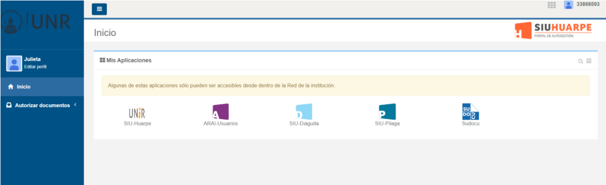
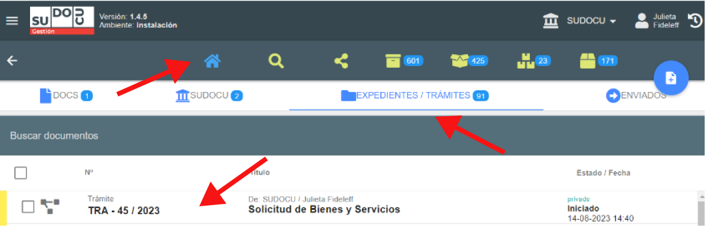

# Incorporar documento a trámite

Descripción breve

## Video tutorial

()?

:::info

:::

## Paso a paso

1.  Ingresar al portal unir la URL [https://unir.unr.edu.ar/](https://unir.unr.edu.ar/) con su usuario (DNI) y contraseña.
    Una vez ingresado sus datos aparece esta pantalla, donde se encuentran todas las aplicaciones que
    posee el usuario.

    

2.  Ingresamos a SUDOCU, donde aparecerá la siguiente pantalla:

    

3.  Una vez dentro del sistema Sudocu, ingresar al módulo de gestión. Allí presionar el botón "documentos" 

    

4.  Seleccionar la opción trámite.

    

    Veremos el siguiente formulario:

    

    :::info

    El campo obligatorio para guardar el trámite es el título. Como verán si no está ingresado el título, el ícono para crear y guardar en color gris .

    :::

5.  Completar el campo título, por ejemplo: Solicitud de Bienes y Servicios y hacer click en el botón de
    guardar 

    Una vez guardado el trámite se creará su numeración.

    

Una vez originado el trámite, se podrán incorporar los documentos correspondientes al mismo
desde el botón “Incorporación”, desde el envío a la firma del documento o desde “Importación
Express” [Ver documentaciòn](./incorporar-doc-a-tramite.md)

## Verificación trámite creado

Si se hace click en listado  y luego en la solapa EXPEDIENTES/TRÁMITES, se visualizará el trámite recientemente creado.

En el caso de que haya algún error en la carga del título, el mismo podrá ser modificado
seleccionando el trámite y presionando el botón “modificar” .

Siempre que se seleccione el trámite, aparecerá una barra con herramientas disponibles, donde se
podrá además de modificar, descargar, remitir, compartir, archivar , entre otras.
