# Creación de un documento y envío a la firma

Una vez que tengo el documento firmado, debe ser incorporado a un trámite.

## Video tutorial

()?

:::info

:::

## Paso a paso

1.  Ingresar al portal unir la URL [https://unir.unr.edu.ar/](https://unir.unr.edu.ar/) con su usuario (DNI) y contraseña.
    Una vez ingresado sus datos aparece esta pantalla, donde se encuentran todas las aplicaciones que
    posee el usuario.

    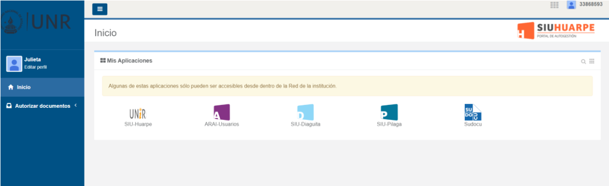

2.  Ingresamos a SUDOCU, donde aparecerá la siguiente pantalla:

    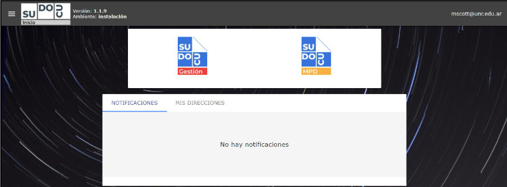

3.  Una vez dentro del sistema Sudocu, ingresar al módulo de gestión. Allí presionar el botón "documentos" 

    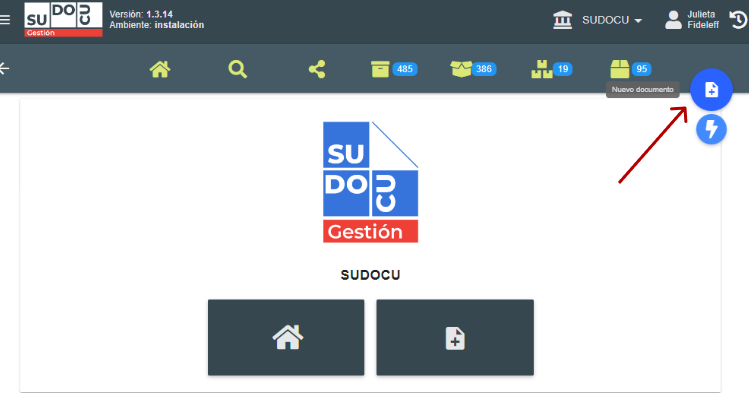

4.  Seleccionar la opción Nota.

    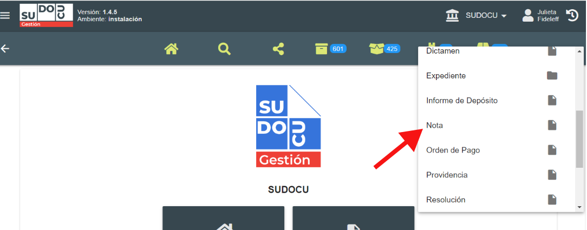

    Se abrirà la siguiente pantalla:

    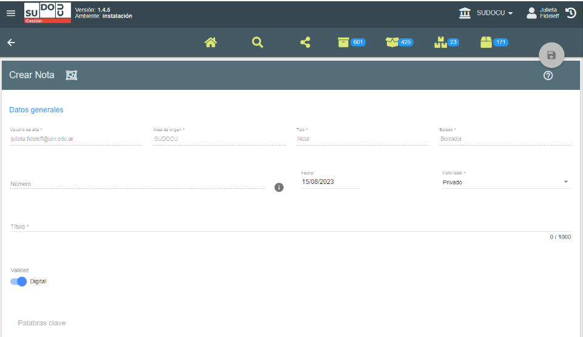

    :::info

    El campo obligatorio para guardar la nota es el título. Como verán si no está ingresado el título, el ícono para crear y guardar en color gris .

    Además en donde dice **“palabras claves”**, se pueden cargar palabras claves que consideren que pueden ser útiles para buscar la nota posteriormente.
    Nota: por cada palabra clave que se carga hacer un “Enter” para que separe a cada una de ellas.

    :::

5.  Completar el campo título, por ejemplo: Solicitud de Bienes y Servicios y hacer click en el botón de
    guardar 

    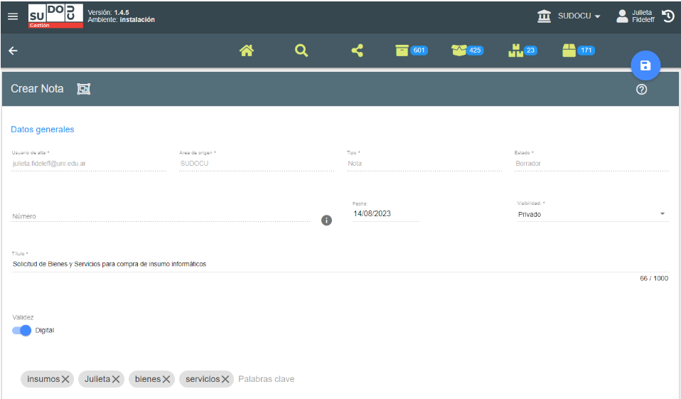

    Una vez guardado el documento se creará su numeración.
    Si se desplaza hacia abajo se pueden visualizar los campos que se han activado luego de guardar el
    documento.

    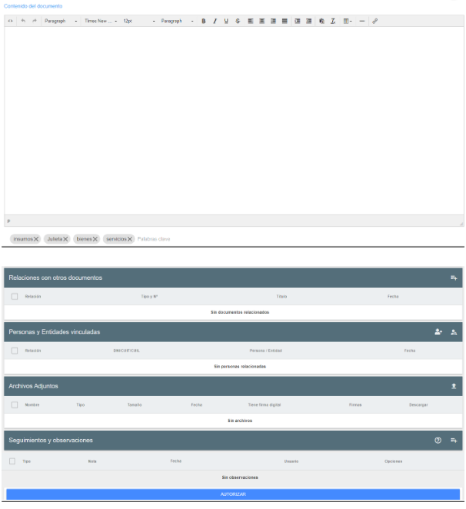

6.  Ahora, lo que van a utilizar es el procesador de texto, similar a Microsoft Word. En el mismo van a
    redactar la nota que desean crear. A modo de ejemplo:

    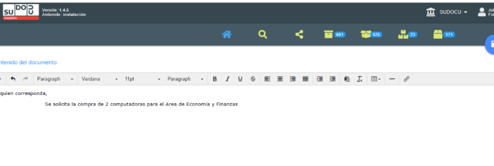

7.  Si desean subir algún documento adicional (adjunto), en el campo con el nombre “Archivos
    Adjuntos” , hacer clic en el botón de subir archivo donde se desplegarán las opciones para
    elegir subir:

    - Archivo de imagen
    - Archivo PDF

    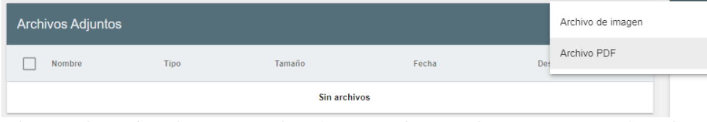

    Y luego presionar guardar  para guardar los cambios realizados en el documento y con la flecha de la izquierda vuelvo hacia atrás a la carpeta DOCS, qué son los documentos del usuario que están en estado borrador o pendientes de firma (Esperando Autorización).

    Una vez guardado el documento, cuando se lo seleccione en el listado “DOCS”, aparecerá una barra con herramientas disponibles, donde se podrá modificar, eliminar, visualizar, copiar, exportar a pdf, remitir, compartir, enviar a cerrar, entre otras.

    Otra forma es presionar listado  e ir a la solapa 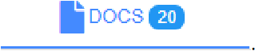

    Antes de autorizar el documento hacer una vista previa del mismo para verificar que esté cargado correctamente.
    Para ver la vista previa de la nota seleccionar el documento y hacer clic en el botón vista previa 

    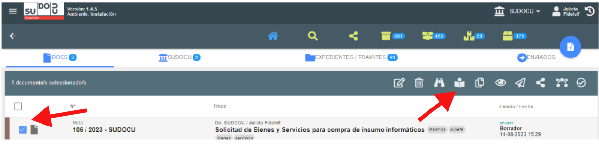

    Veremos:

    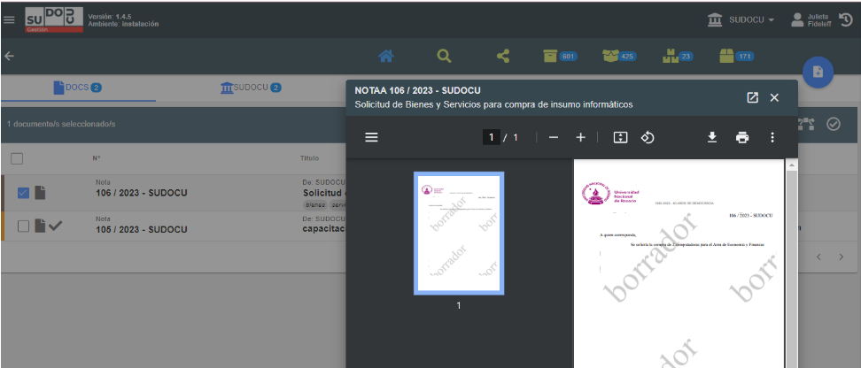

    :::info

    Si deseo puedo abrir la vista previa en otra pestaña presionando en el extremo superior
    derecho [Example banner](../assets/btn-nueva-pestana.png)

    Si el **documento tiene algún error** que deseo corregir y se necesita agregar algo, mientras se
    encuentre en estado borrador podrá ser modificado.

    Para modificarlo lo seleccionamos y presionamos el botón para editar  donde abrirá el formulario de edición del documento.

    :::

8.  Si el documento está cargado correctamente, se procederá a su cierre(Envío a Autorizar).
    Para ello hay dos posibilidades:

    ## a) Que quien creó el documento sea el firmante, esta acción se lleva a cabo seleccionando el documento y haciendo click en el botón . Se abrirá el documento, y al final de todo aparecerá el botón de autorizar.

    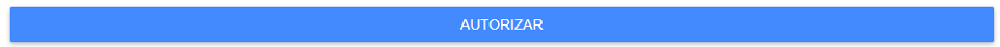

    Si autorizamos aparece la siguiente ventana:

    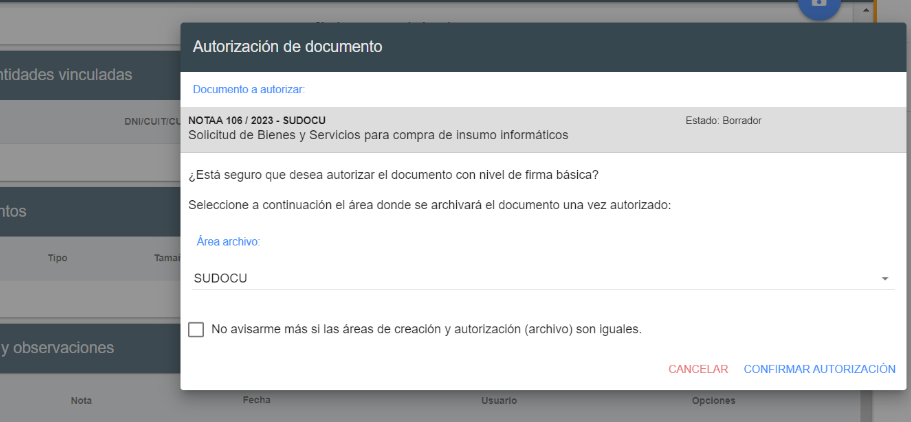

    Allí presiono donde dice “Confirmar Autorización”

    Una vez autorizada la nota, la misma desaparecerá de la bandeja de docs y aparecerá en la solapa de documentos y trámites del área.

    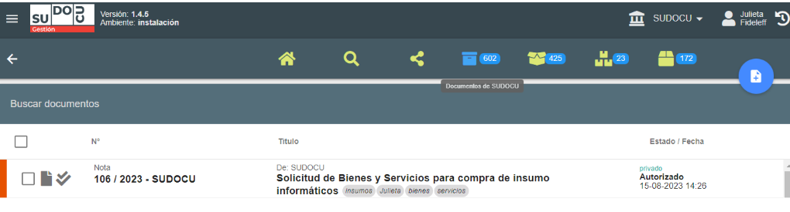

    ## b) Que el documento deba ser firmado por uno o más tercero/s, entonces el cierre se realizará de la siguiente manera

    Se selecciona el documento y se presiona el botón “cerrar" 

    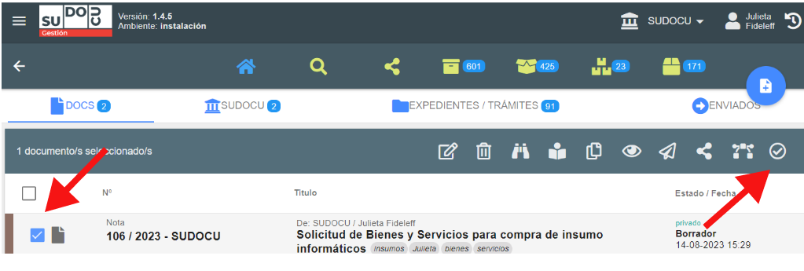

    Allí se abre el siguiente recuadro:

    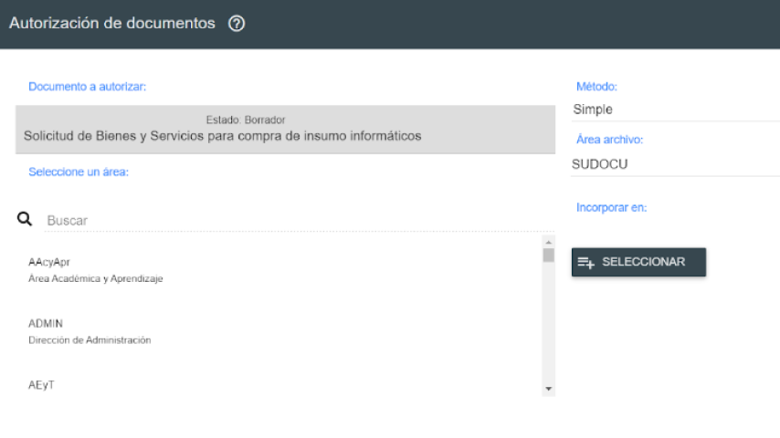

    En la lupa donde dice buscar, se busca a la/s persona/ que firmará/n el documento. Se puede buscar por nombre, apellido, dni o área, recomendamos buscar por área.

    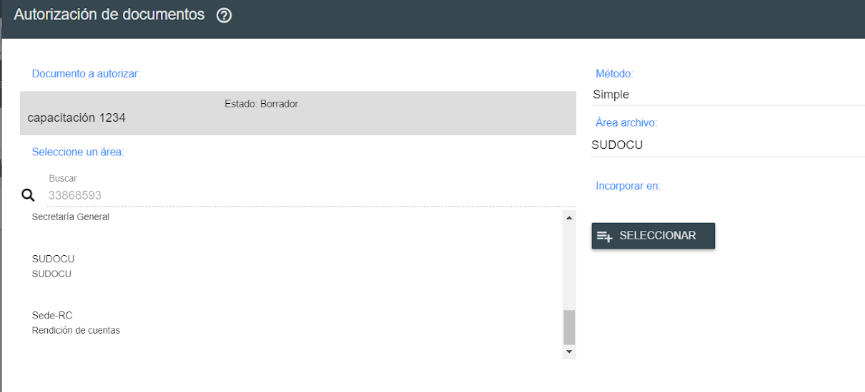

    Siempre encuentra el área donde pertenece la persona, y una vez que ingreso al área aparece esa y el resto de las personas que pertenecen a la misma.

    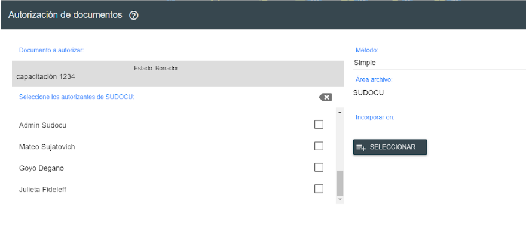

    Selecciono la/s persona/s que van a firmar el documento. Si es más de una persona, seleccionar un método, puede ser:

    - simple: no existe un orden de autorización del documento.

    - escalonada: luego de seleccionar a todos los autorizantes, se deberá indicar el orden en el que cada
      uno de ellos dispondrá del documento en su bandeja para autorizarlo, y no lo podrá visualizar hasta
      que el anterior autorizante lo haya aprobado.

    

    Una vez seleccionados los firmantes, si deseo lo puedo incorporar directamente desde ahí al trámite. Presiono SELECCIONAR y me aparecerán los trámites y expedientes que tengo en el área. Selecciono el trámite/expediente deseado

    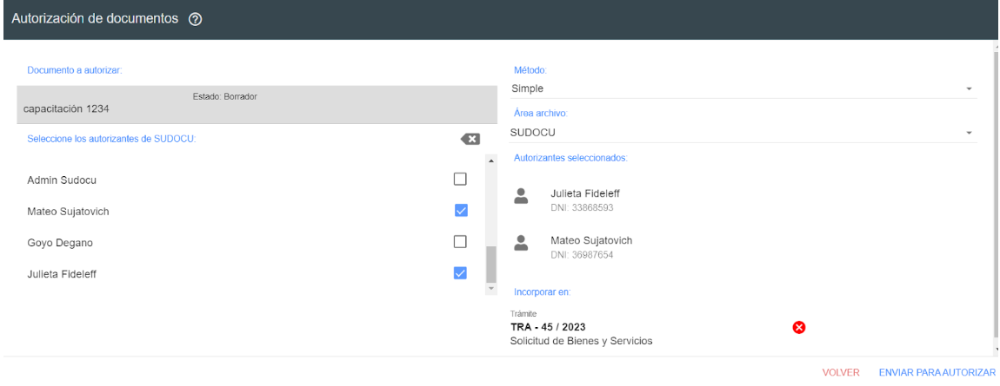

    Presiono Enviar para autorizar, y automáticamente luego de que firmen se incorporará al trámite.

    Si no fue incorporado al trámite, se podrá hacer posteriormente de forma manual.
