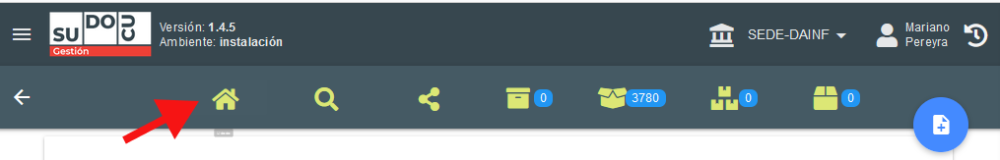
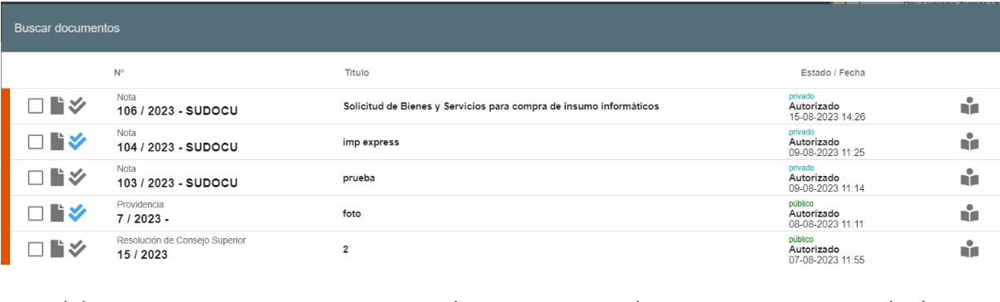

# Incorporar documento a trámite

Una vez que tengo el documento firmado, debe ser incorporado a un trámite.

## Video tutorial

()?

:::info

- Recordar que solo podremos incorporar documentos que fueron previamente autorizados.
- Previo a incorporar el documento puedo realizar la vista previo del mismo para asegurarme de que
  sea el correcto, seleccionándolo y presionando 

:::

## Paso a paso

1.  Ir al listado 
    

2.  Presiono la bandeja de expedientes/trámites
    

3.  Seleccionar y aprietar el lápiz 

    

4.  Si se desplaza hacia abajo se puede visualizar el campo “Documentos Incorporados”

    

5.  Si presionamos el botón INCORPORACIÓN , aparecerán para incorporar todos los documentos,
    que el usuario tiene en su área o son públicos, para ser incorporados. Debo seleccionar el
    documento que deseo incorporar.

    

    _Recordar que solo podremos incorporar documentos que fueron previamente autorizados._

    Previo a incorporar el documento puedo realizar la vista previo del mismo para asegurarme de que
    sea el correcto, seleccionándolo y presionando 

    Si es el documento a incorporar, presionan seleccionar y automáticamente se incorpora al trámite

    

    :::warning Antes de guardar

    Antes de presionar el botón de guardar  es el último momento que hay para eliminar el
    documento del trámite, de lo contrario quedará incorporado y no podrá ser eliminado.

    :::

6.  Guardamos con el botón de guardar , y en ese momento aparecerá con tilde verde.

    
