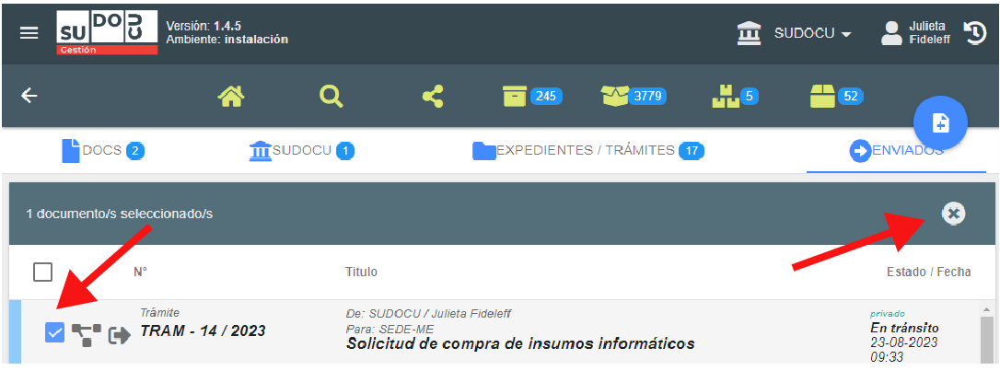

# Remitir trámite

Una vez que tenga toda la documentación correspondiente incorporada al trámite y/o expediente,
se procederá a remitir el mismo al área correspondiente.

:::info

En el caso de que el trámite sea enviado a un área errónea o se encuentren errores en la carga del
mismo, **se podrá cancelar el envío siempre y cuando el área destino no lo haya visto**. Ver paso 3

:::

## Video tutorial

()?

## Paso a paso

1. Desde la solapa EXPEDIENTES / TRÁMITES. **Seleccionar el trámite y/o expediente y hacer click en el botón “Remitir”** 

   

   Otra alternativa para remitir es estando situado dentro del trámite, posicionarse en el botón y sin presionarlo aparecerá la opción de “Guardar y enviar”

   

2. En ambos casos se abrirá el siguiente recuadro. Allí, buscar el área correspondiente (no es necesario
   escribir el nombre completo del área) y seleccionarla y luego hacer click en el botón "remitir".
   Nota: no es necesario completar el campo observaciones.

   

   El trámite desaparecerá de la solapa de expedientes/trámites y se visualizará en la solapa de ENVIADOS

   

3. **Cancelar envío:** en el caso de que el trámite sea enviado a un área errónea o se encuentren errores en la carga del
   mismo, se podrá cancelar el envío siempre y cuando el área destino no lo haya visto.

   Para cancelar el envío se debe seleccionar el trámite y luego presionar el botón 
   . El mismo volverá a la solapa de expedientes/trámites.

   
