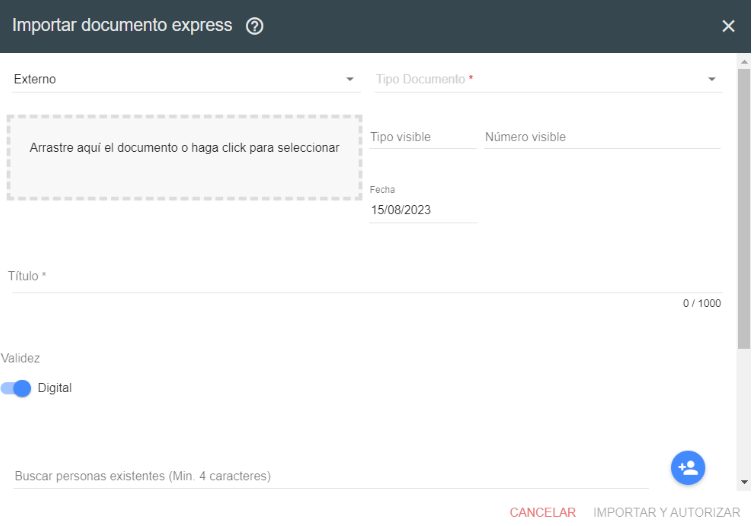
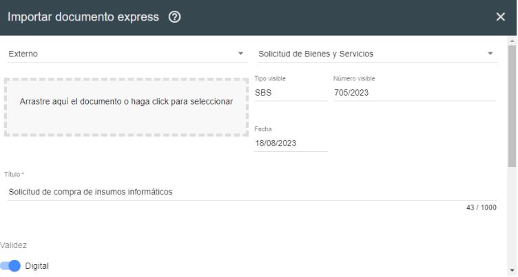
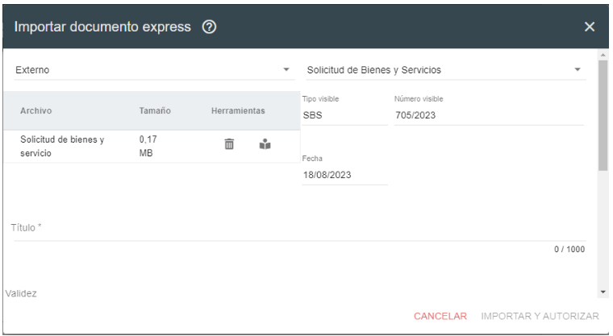
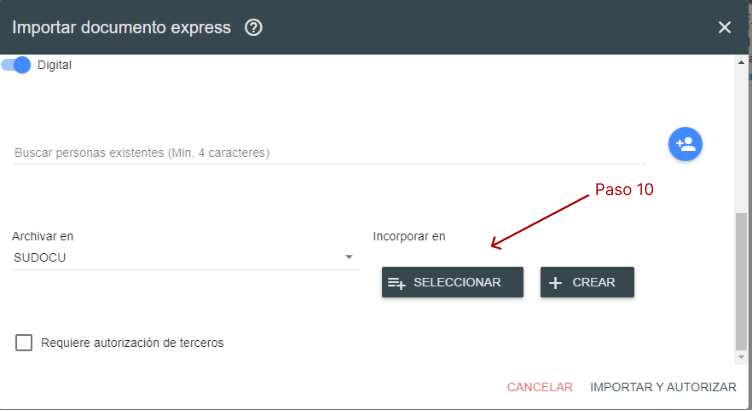
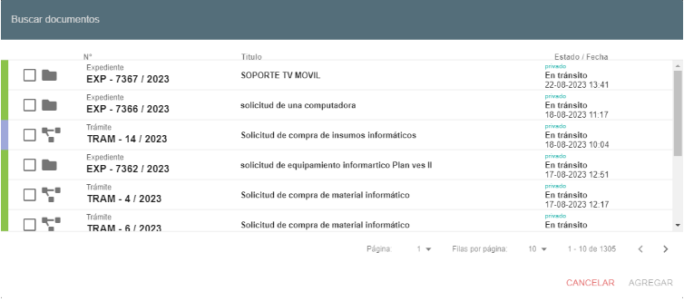
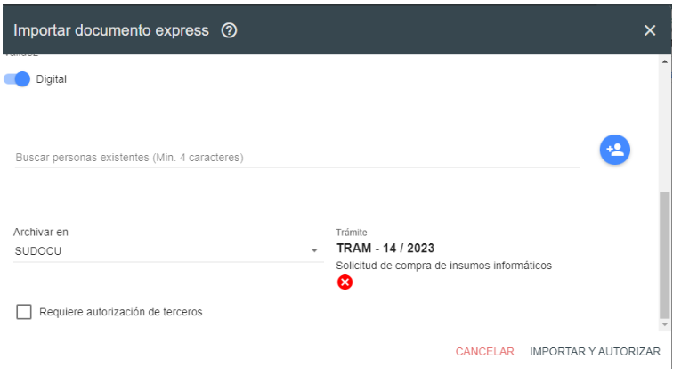
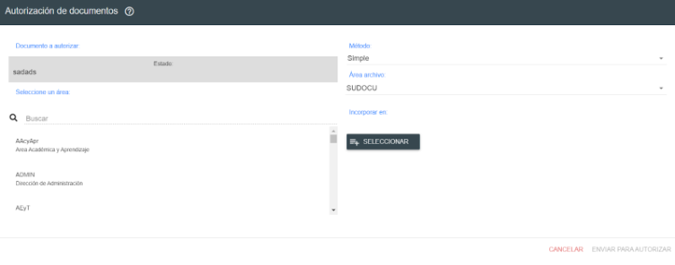
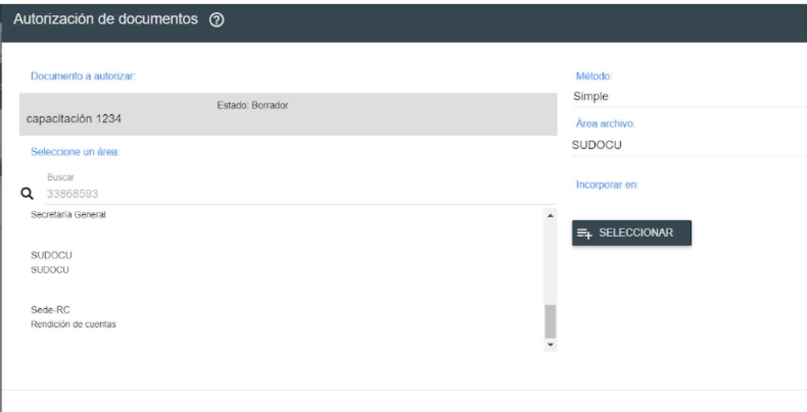
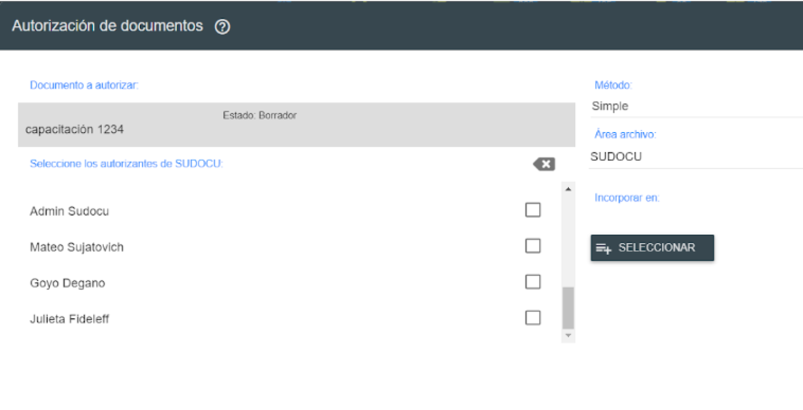
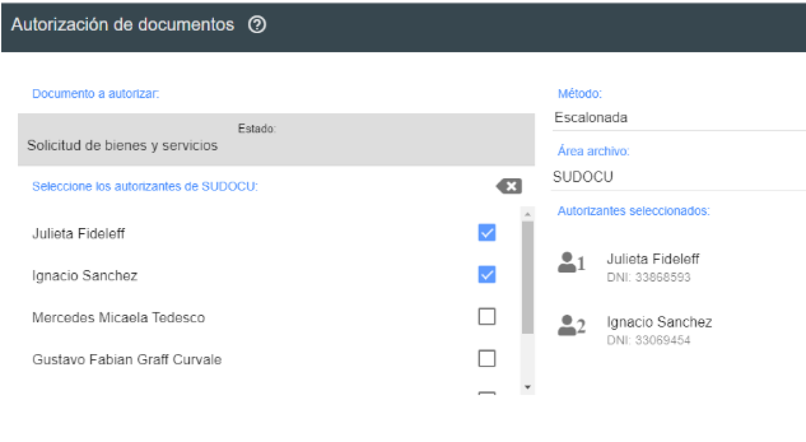

# Subir la solicitud de bienes y servicios por importación express

Explicación breve

## Video tutorial

()?

:::info

- El mismo procedimiento debe realizarse con la Solicitud de Bienes y Servicios - Anexo.
- La solicitud y el anexo se deben subir por separado.
- La autoridad firmante puede ser la misma persona que creó la solicitud en Diaguita.

:::

## Paso a paso

1. Crear la solicitud de bienes y servicios, esto lo realizaremos en [Diaguita](https://diaguita.unr.edu.ar), podemos ingresar desde el portal UNIR [https://unir.unr.edu.ar/](https://unir.unr.edu.ar/) con el DNI y la contraseña seleccionando en el ícono de Diaguita. Una vez creada, se deberá descargar en la PC los 2 PDF (solicitud y anexo).
2. Ingresar al módulo de gestión de SUDOCU.
3. Posicionarse con el cursor en el boton  sin hacer click, aparecerá la opción de importación express  Esta herramienta facilita la incorporación de documentos a partir de la importación de documentos en formato PDF o imágenes que se hayan generado de manera externa a SUDOCU 

   Se abrirá el siguiente formulario:

   

4. Modificar a **externo** el primer campo, por que defecto trae los documentos internos.

5. Seleccionar el tipo de documento, por ejemplo: _Solicitud de Bienes_ y _Servicios o Solicitud de Bienes y Servicios - Anexo_.

6. En el campo **“Tipo visible”**, debemos colocar:

   - en el caso de Solicitud de Bienes y Servicios: **SBS**
   - en el caso de Solicitud de Bienes y Servicios – Anexo: **SBSA**

7. En el campo “Número visible” debo poner el número y el año de la solicitud proveniente de
   Diaguita. Ej: 217/2023

8. Añadir el título, por ejemplo: Solicitud de compra de insumos informáticos

   

9. Seleccionar el documento presionando el recuadro de arrastre. Allí se abre un recuadro
   para buscar el documento dentro de su PC. Una vez cargados podemos ver el documento con la vista previa  y corroborar que sea correcto. También
   presionando el tachito podemos eliminarlo.

   

10. Desplazando hacia abajo podemos incorporar el documento en el trámite correspondiente. En la parte donde dice "Incorporar en" presionamos "Seleccionar" y buscamos el tràmite correspondiente. Lo seleccionamos y presionamos "agregar".

    
    

    Obtenemos lo siguiente:

    

11. Si es necesario, incorporar personas relacionadas en "Buscar personas existentes".
12. Una vez completado, existen dos alternativas:

    - **En caso de ser la autoridad firmante**, presionar el botón "Importar y Autorizar".
    - **Si es necesaria la firma de otra persona/s (Autoridad)**, hay que tildar el cuadrado que dice "Requiere Autorización de Terceros".

      Presionamos importar, se abrirá la siguiente ventana y buscamos a la/s persona/s que firmará/n el documento.

      

      En la lupa donde dice buscar se busca a la/s persona/s que firmará/n el documento. Se puede buscar por nombre, apellido, dni o área. Recomendamos buscar por área.

      

      Introduciendo alguno de los datos mencionados anteriormente (DNI, apellido y/o nombre) siempre encuentra el área donde pertenece la persona, y una vez que ingreso al área aparece esa persona y el resto de las personas que pertenecen a la misma.

      

      Selecciono la/s persona/s que van a firmar el documento. Si es más de una persona, seleccionar un método, puede ser:

      - simple: no existe un orden de autorización del documento.

      - escalonada: luego de seleccionar a todos los autorizantes, se deberá indicar el orden en el que cada
        uno de ellos dispondrá del documento en su bandeja para autorizarlo, y no lo podrá visualizar hasta
        que el anterior autorizante lo haya aprobado.

      

      Una vez seleccionados los firmantes, presiono Enviar para autorizar, y automáticamente luego de que firmen todos se incorporará al trámite seleccionado anteriormente.
